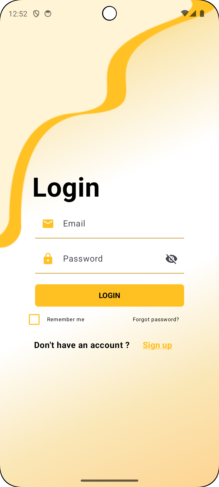
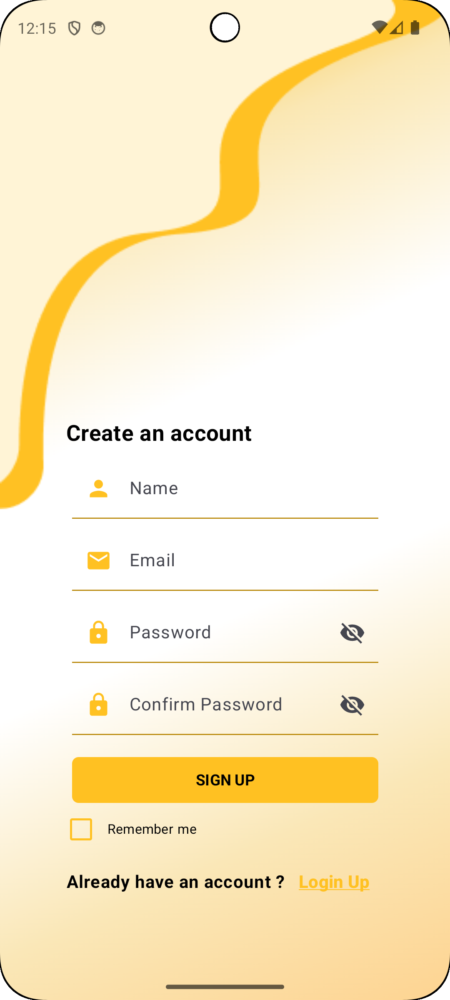

# Jetpack Compose Login and Signup UI

This project demonstrates a **Login** and **Signup** screen built using **Jetpack Compose** in Android. It features a clean, modern UI with input fields, password toggles, and navigation transitions.

## ✨ Features

- Email and password input with icons
- Password visibility toggle
- "Remember me" checkbox
- "Forgot password?" link
- Navigation between Login and Signup screens
- Responsive UI with elegant yellow theme

## 📸 Screenshots

## Login Screen

## Signup Screen

## 🛠 Built With

- Kotlin
- Jetpack Compose
- Material Design
- Android Navigation Component

